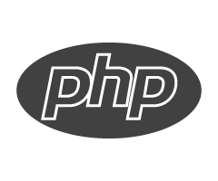

<blockquote>
    Framework personnel léger inpiré de Symfony 
    <em>Natif PHP</em> 
    réalisé chez Alpha Soft <em>(ESN d'applicatifs métiers, PHP Symfony)</em> 
    <a href="https://www.linkedin.com/in/bempime-kheve/" target="_blank"> Bempime KHEVE</a> 
    
&copy; Copyright 2023

</blockquote>
<table>
    <thead>
        <tr>
            <th>
                Documentation
            </th>
            <th>
                <a href="https://php-framework-documentation.bempime-kheve.com ">PHP FRAMEWORK DOCUMENTATION</a>
            underconstruction 1-2 days
            </th>
        </tr>
    </thead>
</table>
<table>
    <thead>
        <tr>
            <th>
                Unit tests in GithHub Actions CI/CD
            </th>
        </tr>
    </thead>
</table>
<table>
    <thead>
        <tr>
            <th>
                SkillValue
            </th>
        </tr>
    </thead>
</table> 

**MVC architecture**

<table>
    <thead>
        <tr>
            <th>
                Components
            </th>
            <th>
                Key points
            </th>
        </tr>
    </thead>
    <tbody>
        <tr>
            <td>
                Index  (PSR-4):
                <a href="https://github.com/Juju075/php_framework/blob/main/public/index.php" target="_blank"> here
                </a> 
            </td>
            <td>
                

                    $app = new \App\Framework\App(); 
                

            </td>
        </tr>
        <tr>
            <td>
                Dependency Injection (PSR-11):
                <a href="https://github.com/Juju075/php_framework/blob/main/src/Framework/Container/Container.php" target="_blank"> here
                </a> 
            </td>
            <td>
                class Container implements ContainerInterface
            </td>
        </tr>
        <tr>
            <td>
               Session Interface 
                (PSR-17) :in progress
            </td>
            <td>
                ..
            </td>
        </tr>
        <tr>
            <td>
               Event Dispatcher  (PSR-14):
                <a href="https://github.com/Juju075/php_framework/blob/main/src/Framework/Event/EventManager.php" target="_blank"> in progress
                </a> 
            </td>
            <td>
                

                    class EventManager implements EventDispatcherInterface 
                

            </td>
        </tr>
        <tr>
            <td>
                Router:
                <a href="https://github.com/Juju075/php_framework/blob/main/src/Framework/Router/Router.php" target="_blank"> here
                </a> 
            </td>
            <td>
                

                    $isRegex = strpos($route->getUrl(), "/^") !== false; 
                

            </td>
        </tr>
        <tr>
            <td>
               Object Relation Model  w/o Reflexion   (recursive function,  File system):
                <a href="https://github.com/Juju075/php_framework/blob/main/src/Framework/Database/Schema.php" target="_blank">
                here </a> 
            </td>
            <td>
                $this->listing = DirectoryResolver::getAllFilesInSubdirectories(ENTITY_DIRECTORY, ['php']);
            </td>
        </tr>
        <tr>
            <td>
               FormBuilder:
                <a href="https://github.com/Juju075/php_framework/blob/main/src/Form/Type/PostType.php" target="_blank"> here </a> 
            </td>
            <td>
                $this->form = new Form('', 'post', ['attribute' => 'test'],
            </td>
        </tr>
        <tr>
            <td>
               QueryBuilder
                <a href="https://github.com/Juju075/php_framework/blob/main/src/Framework/Database/EntityManager.php" target="_blank">
                here </a> 
            </td>
            <td>
                $query = (new Query())->insert($tableName, $keysValues);
            </td>
        </tr>
        <tr>
            <td>
               Hydratation:
                <a href="https://github.com/Juju075/php_framework/blob/main/src/Framework/Database/Hydrator.php" target="_blank">
                here </a> 
            </td>
            <td>
                $dataClean = $isEntity ? $dataArray : FieldResolver::ValuesToClean($dataArray);
            </td>
        </tr>
        <tr>
            <td>
               Repository:
                <a href="https://github.com/Juju075/php_framework/blob/main/src/Framework/Repository/AbstractRepository.php" target="_blank">
                here </a> 
            </td>
            <td>
                $query = (new Query()) 
                    ->select() 
                    ->from($this->getTable()) 
                    ->where($params);
            </td>
        </tr>
        <tr>
            <td>
               Exceptions:
                <a href="https://github.com/Juju075/php_framework/blob/main/src/Exception/NotFoundException.php" target="_blank">
                here </a> 
            </td>
            <td>
                parent::__construct($message, ErrorCode::HTTP_NOT_FOUND);
            </td>
        </tr>
        <tr>
            <td>
               DotEnv:
                <a href="https://github.com/Juju075/php_framework/blob/main/src/Framework/Database/DotEnv.php" target="_blank">
                here </a> 
            </td>
            <td>
                public function load(): self
            </td>
        </tr>
        <tr>
            <td>
               Csrf Token:
                <a href="https://github.com/Juju075/php_framework/blob/main/src/Framework/Form/Token.php" target="_blank">
                here </a> 
            </td>
            <td>
                $token[] = sprintf('<input type="hidden"  name="%s"/>', form::TOKEN_FIELD_NAME);
            </td>
        </tr>
        <tr>
            <td>
               Pagination:
                <a href="https://github.com/Juju075/php_framework/blob/main/templates/content/Pagination.php" target="_blank">
                here </a> 
            </td>
            <td>
                public function calcPagination(int $itemPerPage = 4): self
            </td>
        </tr>
        <tr>
            <td>
               Authentification:
            </td>
            <td>
                ..
            </td>
        </tr>
        <tr>
            <td>
               ..
            </td>
            <td>
                ..
            </td>
        </tr>
    </tbody>
</table>

>This framework respects basic coding usage, PHP clean code inspired from James Padolsey(clean code in javascript) ,
>SOLID principle, pattern designs, implement PSR.

> During those months I learned a lot about PHP especially
> how I can use objects to my advantage, interface, abstract classes
> work effectively with arrays, type correctly.
> spread my responsibility and refactor my code.

